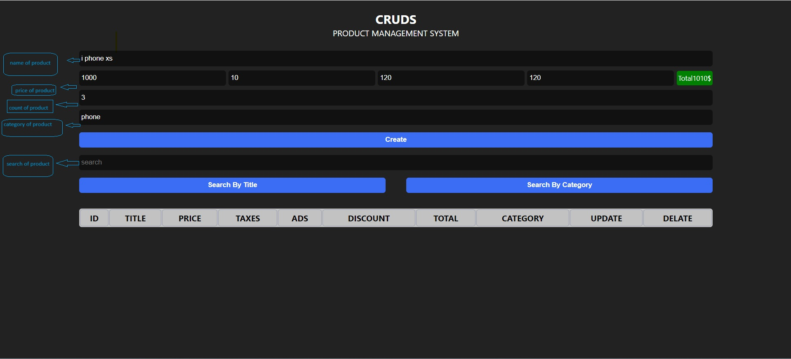

TO clone project in your machine :
 git clone https://github.com/khaledmohamed8895/CURDS

 to start project open this file :(index.html)

Details about (CURDS):

Product Management System - CURDS

Welcome to the Product Management System tutorial! CURDS stands for Create, Read, Update, Delete, and Search.

In this system, you can perform the following operations:

1-Create Product: Add a new product to the system. 
2-Read Product: View the details of a product. 
3-Update Product: Modify the information of an existing product. 
4-Delete Product: Remove a product from the system. 
5-Search Product: Look for a specific product based on certain criteria. 
With this Product Management System, you can efficiently handle your product inventory and keep track of all your products. 

When you click on Let's Get Started, you will go to the project's main page and produce the products as you like want and organize the products as you want. They will appear in the form of a table and you can modify or delete them. Or delete all products, but you must enter a specific password in order to be able to do this through the Clear All button that appears when there are products.

For example:

show product:

 
how it work?: 

<iframe width="560" height="315" src="https://www.youtube.com/watch?v=SdcrvF0l1WM" frameborder="0" allowfullscreen></iframe>
